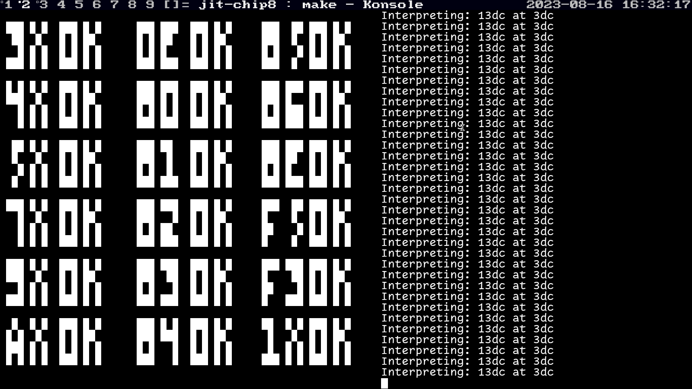

# jit-chip8

JIT compiler for the CHIP-8. Currently, it works erratically and has trouble handling self-modifying code. Because of this, don't expect it to work on most CHIP-8 games, as they make extensive use of self-modifying code.

The generated assembly needs to be optimized as well.

Running [corax's testrom](https://github.com/corax89/chip8-test-rom):

